<picture>
  <source media="(prefers-color-scheme: dark)" srcset="assets/header-dark.svg">
  
</picture>

  <picture>
    <source media="(prefers-color-scheme: dark)" srcset="https://readme-typing-svg.demolab.com/?font=Fira+Code&weight=600&size=20&duration=2800&pause=900&center=true&vCenter=true&width=720&height=44&lines=%D0%A1%D1%82%D1%80%D0%BE%D1%8E%20AI-%D0%B0%D0%B3%D0%B5%D0%BD%D1%82%D0%BE%D0%B2%20%D0%B4%D0%BB%D1%8F%20%D0%BA%D0%B8%D0%B1%D0%B5%D1%80%D0%B1%D0%B5%D0%B7%D0%BE%D0%BF%D0%B0%D1%81%D0%BD%D0%BE%D1%81%D1%82%D0%B8;%D0%9F%D0%BE%D0%B4%D0%BD%D0%B8%D0%BC%D0%B0%D1%8E%20%D1%81%D0%B2%D0%BE%D1%8E%20LLM-%D0%B8%D0%BD%D1%84%D1%80%D0%B0%D1%81%D1%82%D1%80%D1%83%D0%BA%D1%82%D1%83%D1%80%D1%83%20%D0%BD%D0%B0%20SGLang;Pulse%20%E2%80%94%20%D0%BF%D0%B5%D1%80%D0%B2%D0%B0%D1%8F%20%D1%80%D0%BE%D1%81%D1%81%D0%B8%D0%B9%D1%81%D0%BA%D0%B0%D1%8F%20ADE;%D0%94%D0%B8%D1%81%D1%82%D0%B8%D0%BB%D0%BB%D0%B8%D1%80%D1%83%D1%8E%20%D0%BC%D0%BE%D0%B4%D0%B5%D0%BB%D0%B8%20%D0%B4%D0%BB%D1%8F%20security-%D1%82%D0%B5%D0%BA%D1%81%D1%82%D0%BE%D0%B2;Python%20%C2%B7%20TypeScript%20%C2%B7%20FastAPI%20%C2%B7%20React%20%C2%B7%20LangGraph&color=FCEE0A">
    
  </picture>

  
  
  
  

## 

- 🛡️ Строю продукты в **[AVATEK](https://avatek.su)** — компании по информационной безопасности: защита персональных данных, обучение сотрудников, реагирование на инциденты.
- 🤖 Занимаюсь **агентными системами**: графы LangGraph, долгие workflow на Temporal, оркестрация десятков инструментов над реальными API.
- 🧠 Держу **собственную LLM-инфраструктуру**: инференс-ноды на SGLang, шлюз с API-ключами и учётом токенов, операторский дашборд.
- 🔬 Обучаю и **дистиллирую модели** под security-тексты: соц. инженерия, фишинг, оценка CVSS — компактные классификаторы с честной оценкой (bootstrap-CI, multi-seed).
- 🩺 Делаю **учётные системы для клинических лабораторий**: партии реагентов, списание по техкартам, себестоимость исследования, интеграция с ЛИС.
- ⚡ Разработку веду в **агентной парадигме**: Claude Code, свои skills и hooks, а для флота агентов пишу собственную среду — Pulse.

## `// проекты`

> 🔒 Большая часть кода живёт в приватных репозиториях и внутреннем GitLab. Здесь — что и на чём строится.

| Проект | Что это | Стек |
|:--|:--|:--|
| **Pulse** | Первая российская ADE (Agentic Development Environment): каждой задаче — свой git-worktree, в нём работают AI-агенты, а разработчик ставит задачи и видит каждый ход на живом графе. Под контролем разрешения, бюджет, дифф и стоимость. | Electron · React 19 · TypeScript · ACP |
| **AVAREANGE 2.0** | Платформа обучения сотрудников ИБ, фишинговых кампаний и автоматизации реагирования — 7 подпроектов в одном монорепо. | Django · FastAPI · React · PostgreSQL |
| **Mr. Robot** | Агентный runtime поверх AVAREANGE: reasoner-граф из 8 нод, 10 tools над REST API с 357 эндпоинтами, RAG с жёсткой изоляцией по тенантам, LLM через LiteLLM. | LangGraph · Temporal · LiteLLM · LightRAG |
| **Pantheon LLM** | Свой LLM-сервер: роли `main` / `analyst` / `instruct` / `summarizer` / `embed` на SGLang, шлюз с API-ключами и токеномикой, оркестратор с мониторингом GPU и дрейфа моделей. | SGLang · FastAPI · React · DCGM |
| **AVABERT** | Дистилляция AVADarkBERT в компактный классификатор security-текстов: f1 0.964 при 82M параметров и ускорении в 1.8 раза. | PyTorch · Transformers · Knowledge Distillation |
| **LabStock** | Учёт реагентов и расходников клинической лаборатории: приход, партии, суточное списание по техкартам, себестоимость исследования, зеркала таблиц ЛИС, панель управления стендами. | FastAPI · SQLAlchemy · Celery · React |
| **AVATEAM** | Событийная метамодельная ERP: domain events, transactional outbox, метамодель в JSONB, встраиваемые ИИ-агенты. | Node · TypeScript · Vue 3 · PostgreSQL |

## `// стек`

<table>
  <tr>
    <td><b>Языки</b></td>
    <td>
      
      
      
      
      
    </td>
  </tr>
  <tr>
    <td><b>Backend</b></td>
    <td>
      
      
      
      
      
      
      
    </td>
  </tr>
  <tr>
    <td><b>Frontend</b></td>
    <td>
      
      
      
      
      
      
    </td>
  </tr>
  <tr>
    <td><b>AI / ML</b></td>
    <td>
      
      
      
      
      
      
      
    </td>
  </tr>
  <tr>
    <td><b>Инфраструктура</b></td>
    <td>
      
      
      
      
      
      
      
    </td>
  </tr>
  <tr>
    <td><b>Инструменты</b></td>
    <td>
      
      
      
      
      
    </td>
  </tr>
</table>

## `// статистика`

  

  

  <picture>
    <source media="(prefers-color-scheme: dark)" srcset="assets/langs-dark.svg">
    
  </picture>

<picture>
  <source media="(prefers-color-scheme: dark)" srcset="https://raw.githubusercontent.com/NameLucky2205/NameLucky2205/output/snake-dark.svg">
  
</picture>

## `// форки и инструменты, которыми пользуюсь`

- [everything-claude-code](https://github.com/NameLucky2205/everything-claude-code) — харнесс для Claude Code: skills, instincts, память, хуки. На нём собран мой рабочий контур.
- [open-design](https://github.com/NameLucky2205/open-design) — локальная open-source альтернатива Claude Design: прототипы, слайды, дизайн-системы.
- [Graft-save-token](https://github.com/NameLucky2205/Graft-save-token) — контекстное понимание кодовой базы для агентов, экономия токенов.
- [exo-ai](https://github.com/NameLucky2205/exo-ai) — запуск frontier-моделей локально на нескольких устройствах.
- [twenty-teamerp](https://github.com/NameLucky2205/twenty-teamerp) — открытая CRM, база для экспериментов с ERP.
- [dbeaver](https://github.com/NameLucky2205/dbeaver) — универсальный SQL-клиент.

  Шапка, нейтраннер и полоса языков — свои SVG, собираются скриптом <code>scripts/gen_assets.py</code>. Иконка вдохновлена нейтраннерами Cyberpunk 2077, нарисована с нуля.

